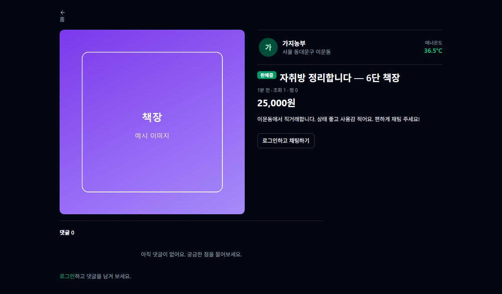
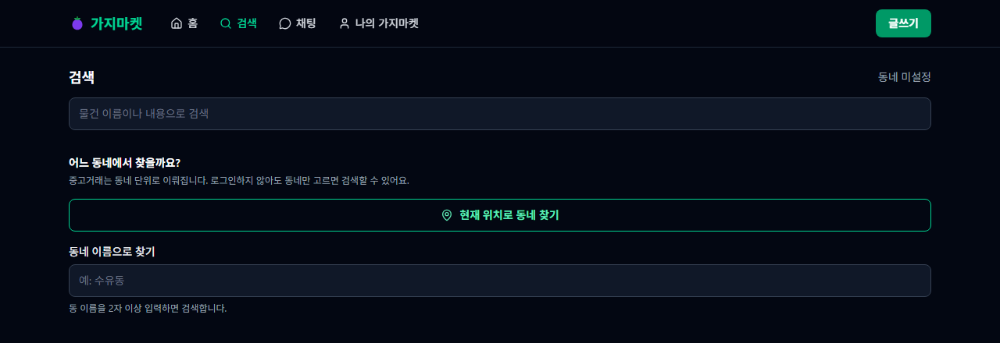
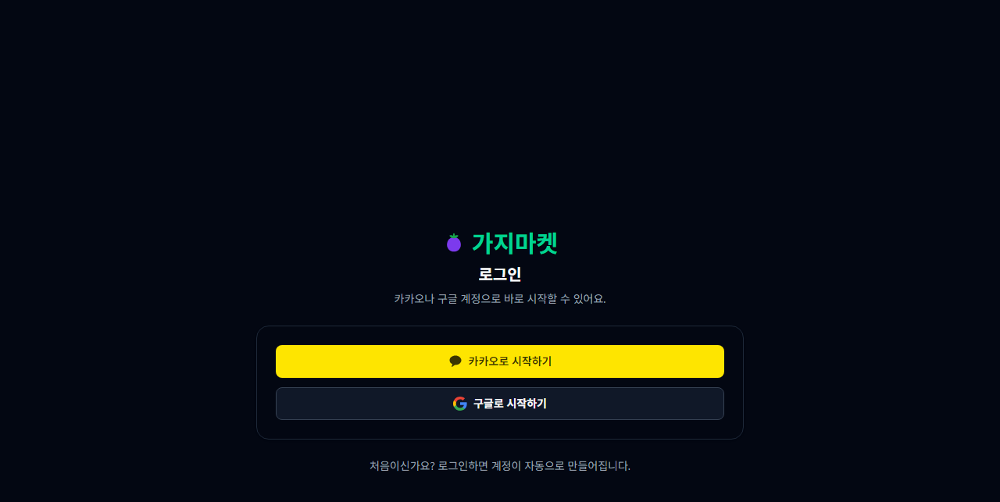

<div align="center">
  

  <p><strong>우리 동네 이웃과 중고물품을 사고파는 곳.</strong><br />
  당근마켓 클론코딩 프로젝트입니다.</p>

  <p>
    <a href="https://eggplant-market-ga6d-flame.vercel.app"><b>배포된 앱 열기 →</b></a>
  </p>
</div>

---

## 화면

| 게시물 상세 | 검색 |
|---|---|
|  |  |



> 스크린샷의 상품은 **화면을 찍으려고 잠깐 넣었다가 지운 예시 데이터**입니다.
> 사진 자리는 색판으로 대신했습니다.

---

## 무엇을 만들었나

- **로그인** — 카카오 · 구글. 이메일·비밀번호는 쓰지 않으므로 가입과 로그인의 구분이 없습니다.
- **동네 설정** — 법정동 기준. 카카오맵으로 현재 위치를 잡거나 동 이름으로 찾습니다.
- **게시물** — 사진 여러 장 · 가격 · 거래장소 · 카테고리, 판매중 → 거래중 → 거래완료.
- **탐색** — 동네 기준 목록 · 검색 · 지도 · 카테고리 필터 · 찜 · 최근 본 글.
- **채팅** — Realtime 1:1 대화, 사진 전송, **가격 제안**, 읽음 표시.
- **거래 후** — 매너온도 · 후기 · 매너 태그.
- **그 밖** — 알림(종류별 on/off) · 댓글과 대댓글(비밀 댓글 포함) · 차단 · 신고 · 회원탈퇴 · 다크모드.

기능 명세는 [`feature.md`](./feature.md), 일부러 만들지 않기로 한 것은 [`backlog.md`](./backlog.md)에 있습니다.

---

## 기술 스택

| 영역 | 선택 |
|---|---|
| 빌드 | Vite + React 19 + TypeScript (SPA) |
| 스타일 | Tailwind CSS v4 (클래스 기반 다크모드) |
| 라우팅 | React Router |
| 클라이언트 상태 | Zustand — 세션 · 테마 |
| 서버 상태 | TanStack Query — 캐싱 · 무한스크롤 |
| 백엔드 | Supabase — Postgres · Auth · Storage · Realtime |
| 권한 | **전부 RLS**. 화면이 아니라 DB가 지킵니다 |
| 지도 | 카카오맵 JS SDK |
| 테스트 | Jest + ts-jest + React Testing Library |
| 배포 | Vercel (프론트) · Supabase (DB·인증·스토리지·Edge Function) |

마이그레이션 **35개**가 스키마·정책·트리거를 담고 있습니다(`supabase/migrations`).
왜 그렇게 만들었는지는 각 SQL 파일 맨 위 주석에 적혀 있습니다.

---

## 로컬에서 돌리기

Node 20 이상이 필요합니다.

```bash
npm install
cp .env.example .env.local   # 값을 채운다
npm run dev
```

`.env.local`에 넣을 값은 넷입니다.

| 이름 | 어디서 | 쓰는 곳 |
|---|---|---|
| `VITE_SUPABASE_URL` | Supabase → Project Settings → API | 앱 |
| `VITE_SUPABASE_ANON_KEY` | 〃 | 앱 |
| `VITE_KAKAO_MAP_KEY` | 카카오 개발자 → 플랫폼 키 → **JavaScript 키** | 지도 |
| `SUPABASE_SERVICE_ROLE_KEY` | Supabase → Project Settings → API | **통합 테스트만** |

> **마지막 것에 `VITE_` 접두사를 붙이면 안 됩니다.** Vite는 `VITE_`로 시작하는 값을
> 번들에 그대로 넣으므로, 붙이는 순간 브라우저를 여는 누구나 RLS를 지나갈 수 있게 됩니다.

DB는 `supabase/migrations`를 번호 순서대로 실행해 만듭니다.

---

## 테스트

`jest.config.cjs`가 **네 갈래**로 나뉩니다. 갈래마다 **묻는 질문이 다릅니다.**

| 명령 | 갈래 | 무엇을 묻나 |
|---|---|---|
| `npm test` | unit + integration | **로직이 맞는가** · **DB와 정책이 맞는가** |
| `npm run test:build` | build | **제대로 만들어졌는가** (`dist/`를 읽는다) |
| `npm run test:smoke -- <주소>` | smoke | **제대로 서비스되는가** (배포된 주소를 두드린다) |

```bash
npm test                 # 894개
npm run test:build       # 35개 — 빌드부터 하고 돈다
npm run test:smoke -- https://eggplant-market-ga6d-flame.vercel.app   # 21개
```

- **integration은 mock이 없습니다.** 실제 Supabase 프로젝트에 붙어 **화면이 부르는 함수를 그대로** 밟습니다. 그래서 `SUPABASE_SERVICE_ROLE_KEY`가 필요합니다.
- **build와 smoke를 나눈 이유**: 빌드가 맞아도 배포가 틀릴 수 있습니다. `smoke`가 빨간데 `build`가 초록이면 **코드가 아니라 배포가 밀린 것**입니다.
- 자세한 전략과 **닿지 못하는 곳**은 [`docs/architecture.md`](./docs/architecture.md) §6에 있습니다.

```bash
npm run lint     # eslint — 화살표 함수 금지·any 금지를 강제한다
npm run build    # tsc --noEmit && vite build
```

---

## 문서

이 저장소는 **왜 그렇게 만들었는지**를 코드만큼 적어 두었습니다.
무엇을 찾는지에 따라 읽을 곳이 다릅니다 — 안내는 [`CLAUDE.md`](./CLAUDE.md)의 표에 있습니다.

가장 자주 보게 되는 둘만 적으면,

- [`note.md`](./note.md) — **이미 만든 것을 왜 그렇게 만들었는가.** 고치기 전에 그 절부터 읽습니다.
- [`troble.md`](./troble.md) — 증상 → 원인 → 해결. 같은 자리에서 두 번 헤매지 않으려고 남깁니다.
