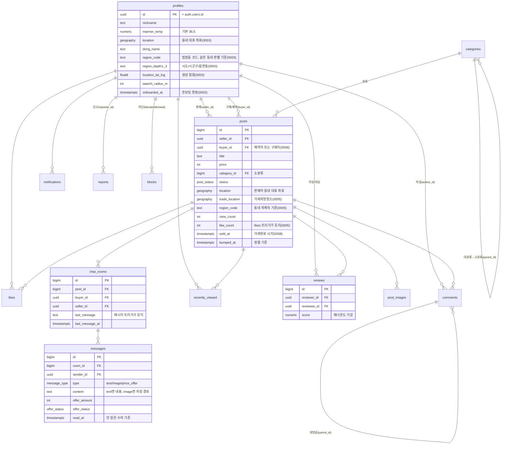

# ERD — EggPlant Market

전체 컬럼·제약은 [`../supabase/migrations/`](../supabase/migrations/)의 각 파일 참고.
아래는 테이블 관계 요약(mermaid). GitHub 등에서 렌더링됨.



## 열거형(Enum)

| Enum | 값 |
|---|---|
| `post_status` | selling · reserved · sold |
| `message_type` | text · image · price_offer |
| `offer_status` | pending · accepted · rejected |
| `notification_type` | comment · like · chat · review · price_offer |
| `report_target` | post · user |

## 거래 상태 전이

`enforce_post_status_transition` 트리거(0008)가 지킨다. 화면의
`post/utils/postStatusTransition.ts`가 같은 규칙을 들고 있다.

```
판매중 ⇄ 예약중 → 거래완료(종착점, 되돌릴 수 없음)
```

- 예약중·거래완료로 갈 때 `buyer_id`를 함께 정한다(고르지 않아도 된다).
- 판매중으로 돌아오면 트리거가 `buyer_id`를 지운다.
- 거래완료가 되면 트리거가 `sold_at`을 찍는다.

## 저장소(Storage)

| 버킷 | 공개 | 용량 | 경로 규칙 |
|---|---|---|---|
| `avatars` (0002) | 공개 | 2MB | `{user_id}/…` |
| `post-images` (0005) | 공개 | 5MB | `{user_id}/…` |
| `chat-images` (0008) | **비공개** | 5MB | `{room_id}/{user_id}/…` |

`chat-images`만 비공개다. 1:1 대화 내용이라 URL을 아는 사람 누구나 볼 수 있으면 안 된다.
방 참여자만 읽을 수 있고, 앱은 볼 때마다 서명 URL을 만든다.

## Realtime

`supabase_realtime` publication에 `messages`·`chat_rooms`가 들어 있다(0008).
구독은 RLS를 그대로 타므로 남의 방 메시지는 흘러가지 않는다.
