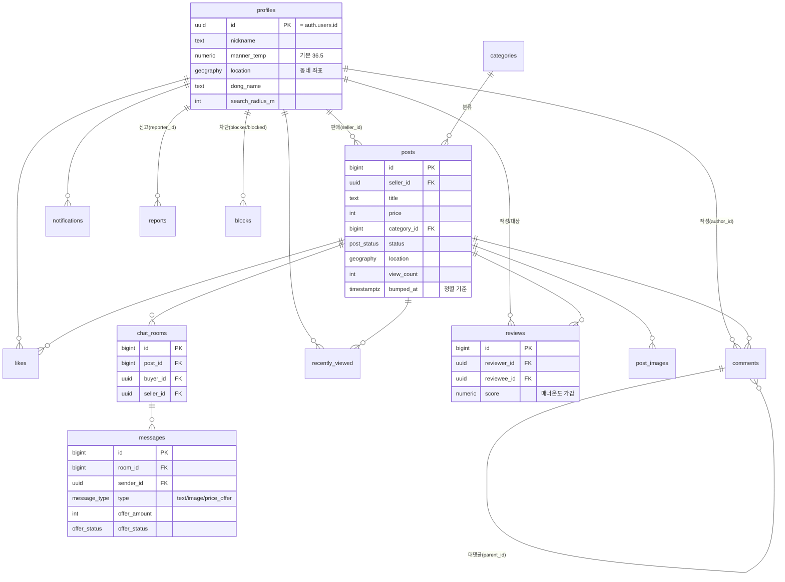

# ERD — EggPlant Market

전체 컬럼·제약은 [`../supabase/migrations/0001_init.sql`](../supabase/migrations/0001_init.sql) 참고.
아래는 테이블 관계 요약(mermaid). GitHub 등에서 렌더링됨.

## 열거형(Enum)

| Enum | 값 |
|---|---|
| `post_status` | selling · reserved · sold |
| `message_type` | text · image · price_offer |
| `offer_status` | pending · accepted · rejected |
| `notification_type` | comment · like · chat · review · price_offer |
| `report_target` | post · user |
